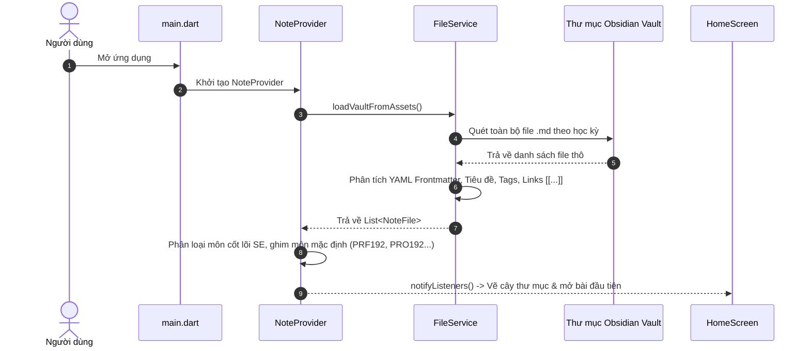
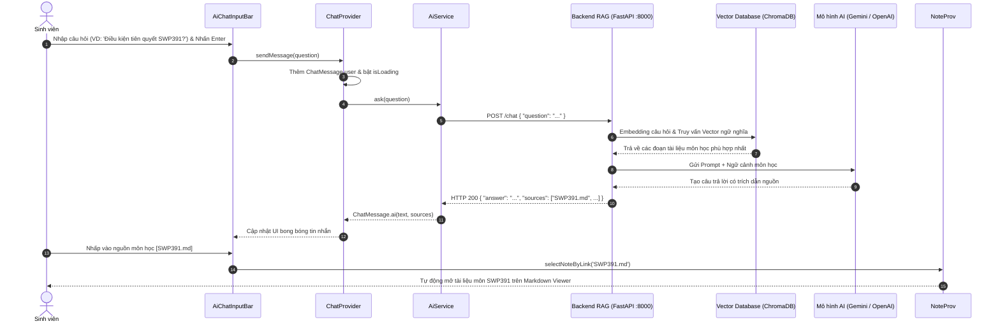

# TÀI LIỆU GIẢI THÍCH TOÀN BỘ MÃ NGUỒN FLUTTER (FE-UI)
> **Dự án:** Obsidian Brain — Hệ thống Second Brain Quản Lý Môn Học & Trợ Lý AI RAG (FPT University)  
> **Framework:** Flutter (Desktop Windows/macOS/Linux, Web, Mobile)  
> **Kiến trúc:** Layered Architecture / MVVM kết hợp Provider State Management  

---

## MỤC LỤC
1. [Tổng Quan Kiến Trúc Dự Án](#1-tổng-quan-kiến-trúc-dự-án)
2. [Sơ Đồ Luồng Hoạt Động (Architecture & Data Flow)](#2-sơ-đồ-luồng-hoạt-động-architecture--data-flow)
3. [Giải Thích Chi Tiết Từng File Mã Nguồn](#3-giải-thích-chi-tiết-từng-file-mã-nguồn)
   - [3.1 Entry Point (Điểm khởi chạy)](#31-entry-point)
   - [3.2 Tầng Models (Cấu trúc dữ liệu)](#32-tầng-models)
   - [3.3 Tầng Providers (Quản lý trạng thái State Management)](#33-tầng-providers)
   - [3.4 Tầng Services (Dịch vụ ngoài & API)](#34-tầng-services)
   - [3.5 Tầng Utils (Thuật toán & Tiện ích trợ giúp)](#35-tầng-utils)
   - [3.6 Tầng Screens (Màn hình chính)](#36-tầng-screens)
   - [3.7 Tầng Widgets (Thành phần giao diện người dùng)](#37-tầng-widgets)
     - [Nhóm Obsidian (Thanh điều hướng & Sidebar)](#nhóm-obsidian)
     - [Nhóm Graph 3D (Đồ thị tri thức không gian 3 chiều)](#nhóm-graph-3d)
     - [Nhóm Course (Chi tiết thông tin môn học & Đánh giá điểm)](#nhóm-course)
     - [Nhóm AI Chat (Trợ lý thông minh RAG Assistant)](#nhóm-ai-chat)
     - [Các widget Markdown Viewer & Split View](#các-widget-khác)
4. [Các Thuật Toán & Kỹ Thuật Độc Đáo Trong Ứng Dụng](#4-các-thuật-toán--kỹ-thuật-độc-đáo)
5. [Tương Tác Phím Tắt & Trải Nghiệm Người Dùng (UX)](#5-tương-tác-phím-tắt--trải-nghiệm-người-dùng)
6. [Hệ Thống Kiểm Thử Tự Động (Unit & Widget Tests)](#6-hệ-thống-kiểm-thử-tự-động)

---

## 1. TỔNG QUAN KIẾN TRÚC DỰ ÁN

Dự án được xây dựng theo mô hình **Layered Architecture (Kiến trúc phân tầng)** kết hợp với **Provider Pattern** để quản lý trạng thái phản ứng (Reactive State Management). Mã nguồn được tổ chức trong thư mục `lib/` với tính module hóa cao, đảm bảo nguyên lý **Single Responsibility Principle (Mỗi file đảm nhiệm một trách nhiệm duy nhất)** và không có file nào quá dài hoặc cồng kềnh.

```
FE-UI/lib/
├── main.dart                          # Điểm khởi chạy ứng dụng, cấu hình Theme & MultiProvider
├── models/                            # Định nghĩa thực thể dữ liệu (Data Entities)
│   ├── note_file.dart                 # Thực thể file ghi chú / môn học markdown
│   ├── chat_message.dart              # Thực thể tin nhắn hội thoại Chatbot RAG
│   ├── course_metadata.dart           # Bóc tách cấu trúc đề cương, tín chỉ, % điểm thi
│   └── graph_node_3d.dart             # Tọa độ 3D và cạnh liên kết trong không gian
├── providers/                         # Quản lý trạng thái và thông báo thay đổi giao diện
│   ├── note_provider.dart             # Quản lý kho ghi chú, tìm kiếm, bookmark, cây thư mục
│   └── chat_provider.dart             # Quản lý phiên chat AI, lịch sử tin nhắn, đóng/mở panel
├── services/                          # Tương tác hệ thống tệp và kết nối API ngoài
│   ├── file_service.dart              # Đọc/ghi và duyệt cây thư mục Obsidian Vault
│   └── ai_service.dart                # Giao tiếp HTTP REST API với Backend FastAPI RAG
├── utils/                             # Tiện ích toán học & xử lý chuỗi
│   ├── constants.dart                 # Hằng số toàn cục ứng dụng
│   ├── graph_3d_physics.dart          # Phân bố cầu Fibonacci & giải thuật lò xo lực 3D
│   └── markdown_table_converter.dart  # Chuẩn hóa bảng Markdown sang GitHub Table
├── screens/                           # Màn hình ứng dụng
│   └── home_screen.dart               # Khung sườn Scaffold bố trí toàn bộ ứng dụng
└── widgets/                           # Các khối giao diện người dùng
    ├── obsidian/                      # Nhóm thanh điều hướng kiểu Obsidian
    │   ├── obsidian_activity_bar.dart # Thanh ribbon icon dọc bên trái (52px)
    │   ├── obsidian_sidebar.dart      # Cột sidebar nội dung động (285px)
    │   ├── obsidian_search_view.dart  # Tìm kiếm toàn văn văn bản có highlight
    │   └── obsidian_bookmarks_view.dart # Danh sách môn cốt lõi SE & ghi chú đã ghim
    ├── graph/                         # Nhóm đồ thị tri thức mạng 3D
    │   ├── graph_view_dialog.dart     # Cửa sổ Dialog chứa mạng 3D và Side Panel
    │   ├── graph_3d_painter.dart      # CustomPainter chiếu 3D sang 2D Canvas & render
    │   ├── graph_course_side_panel.dart # Thanh trượt xem nhanh thông tin môn bên phải
    │   ├── graph_view_toolbar.dart    # Thanh công cụ nổi xoay, zoom, đổi màu, nhãn
    │   └── file_tree_view.dart        # Cây thư mục dạng Folder/File đa cấp
    ├── course/                        # Nhóm thành phần hiển thị chi tiết môn học
    │   ├── course_info_header.dart    # Header mã môn, số tín chỉ, điều kiện pass môn
    │   ├── course_assessment_view.dart# Bảng % trọng số điểm và thanh màu trực quan
    │   └── course_prerequisites_view.dart # Danh sách thẻ môn tiên quyết [[...]]
    ├── AI Chat/                       # Nhóm khung trò chuyện thông minh RAG
    │   ├── ai_chat_panel.dart         # Container khung chat có thanh kéo co giãn chiều rộng
    │   ├── ai_chat_message_bubble.dart# Bong bóng tin nhắn, nút Copy & trích dẫn nguồn
    │   ├── ai_chat_input_bar.dart     # Ô gõ câu hỏi, phím Enter gửi & chip gợi ý
    │   └── ai_chat_loading_bubble.dart# Trạng thái loading đang tra cứu tài liệu
    ├── markdown_viewer.dart           # Trình đọc tài liệu Markdown với thanh công cụ
    └── split_view.dart                # Bộ phân chia màn hình kéo thả đa nhiệm
```

---

## 2. SƠ ĐỒ LUỒNG HOẠT ĐỘNG (ARCHITECTURE & DATA FLOW)

### 2.1 Luồng khởi động ứng dụng & tải kho Obsidian Vault



### 2.2 Luồng xử lý đồ thị tri thức 3D (Graph View)

```mermaid
flowchart TD
    A[Mở Graph View Dialog] --> B[Lấy List NoteFile từ NoteProvider]
    B --> C[Graph3DPhysics.buildGraph]
    C --> D[Phân bố các node theo khối cầu Fibonacci 3D]
    D --> E[Liên kết các cạnh Edge từ cú pháp link [[...]]]
    E --> F[Chạy 45 vòng lặp giải thuật lò xo lực 3D Relaxation]
    F --> G[Graph3DPainter: Phối cảnh 3D sang 2D Screen Coordinate]
    G --> H{Mức Zoom hiện tại}
    H -->|Zoom <= 1.02| I[Chỉ hiện nhãn môn đang hover/chọn]
    H -->|Zoom > 1.02| J[Tự động hiện nhãn TẤT CẢ môn học có đổ bóng]
    G --> K[Người dùng nhấp vào 1 nút môn học]
    K --> L[Mở GraphCourseSidePanel bên phải mà không đổi trang]
    L --> M[Bấm View Details -> Mở Markdown Viewer chính]
```

### 2.3 Luồng hỏi đáp trợ lý thông minh (AI RAG Assistant)



---

## 3. GIẢI THÍCH CHI TIẾT TỪNG FILE MÃ NGUỒN

### 3.1 Entry Point
#### `lib/main.dart`
- **Mục đích**: Điểm nhập (Entry point) của ứng dụng Flutter.
- **Thành phần chính**:
  - `main()`: Gọi `WidgetsFlutterBinding.ensureInitialized()` và khởi chạy `SecondBrainApp`.
  - `MultiProvider`: Đăng ký 2 provider trung tâm là `NoteProvider` và `ChatProvider` để mọi widget bên dưới cây widget đều có thể lắng nghe và truy xuất dữ liệu.
  - `MaterialApp`: Thiết lập Theme tối (Dark Mode) phong cách than chì huyền bí Obsidian (`#0F0F12`, `#18181B`, `#27272A`), thiết lập ngôn ngữ, tiêu đề ứng dụng và đặt `HomeScreen` làm màn hình gốc.

---

### 3.2 Tầng Models
#### `lib/models/note_file.dart`
- **Mục đích**: Định nghĩa cấu trúc dữ liệu của một tài liệu môn học Markdown.
- **Thuộc tính**:
  - `path`, `fileName`: Đường dẫn và tên file `.md`.
  - `title`: Tiêu đề môn học (được lấy từ thẻ Heading `#` hoặc frontmatter).
  - `rawContent`: Toàn bộ nội dung chuỗi Markdown gốc của file.
  - `tags`: Danh sách thẻ tag (ví dụ: `[Programming, PRF192]`).
  - `links`: Danh sách liên kết hai chiều kiểu Obsidian `[[Tên_Môn]]` được bóc tách từ nội dung.
  - `folderName`: Thư mục học kỳ chứa môn học (VD: `Kỳ 1`, `Kỳ 7/SE_COM＊2`).

#### `lib/models/chat_message.dart`
- **Mục đích**: Lưu trữ thông tin một tin nhắn trong đoạn hội thoại với Trợ lý AI.
- **Thuộc tính**:
  - `text`: Nội dung câu hỏi hoặc câu trả lời AI (hỗ trợ Markdown).
  - `isUser`: `true` nếu là tin nhắn sinh viên gửi, `false` nếu là phản hồi từ AI.
  - `timestamp`: Thời điểm gửi tin nhắn.
  - `sources`: Danh sách file tài liệu mà AI đã tham khảo để trả lời (dùng cho RAG citations).
  - `isError`: Cờ báo lỗi khi không kết nối được máy chủ Backend.

#### `lib/models/course_metadata.dart`
- **Mục đích**: Bộ bóc tách (Parser) chuyên sâu trích xuất dữ liệu học vụ chuẩn FPT University từ nội dung file Markdown.
- **Lớp chính**:
  - `AssessmentComponent`: Đại diện cho 1 đầu điểm đánh giá (Category: Assignment, Lab, PE, FE...; Trọng số %; Điều kiện qua môn: $\ge 4.0$ điểm liệt hay $> 0$; Màu sắc hiển thị).
  - `CourseMetadata`: Bóc tách mã môn (`Mã môn học`), tên tiếng Anh, số tín chỉ, danh sách môn tiên quyết, điều kiện pass môn (chuyên cần $\ge 80\%$, GPA $\ge 5.0$, điểm thi FE/PE $\ge 4.0$), bảng đánh giá chi tiết và mô tả môn học không bị cắt cụt.

#### `lib/models/graph_node_3d.dart`
- **Mục đích**: Cấu trúc dữ liệu dành riêng cho hiển thị đồ thị không gian 3 chiều.
- **Lớp chính**:
  - `GraphNode3D`: Nút đại diện cho 1 môn học. Chứa tọa độ thực tế trong không gian 3D $(x, y, z)$, tọa độ sau khi chiếu phối cảnh lên màn hình 2D $(screenX, screenY)$, độ sâu camera $depth$, bậc liên kết $degree$, bán kính hình tròn $radius$ và màu sắc theo học kỳ.
  - `GraphEdge3D`: Cạnh nối giữa 2 nút `source` và `target` biểu thị mối quan hệ tiên quyết.

---

### 3.3 Tầng Providers
#### `lib/providers/note_provider.dart`
- **Mục đích**: Quản lý toàn bộ dữ liệu ghi chú của ứng dụng, hoạt động như một Single Source of Truth cho tài liệu.
- **Chức năng chính**:
  - Tự động nạp toàn bộ file trong thư mục `Lab 1 - Obsidian second brain` khi ứng dụng mở.
  - Quản lý môn học đang được chọn đọc (`selectedNote`).
  - Tìm kiếm tài liệu: Tìm kiếm theo tiêu đề, mã môn học và tìm kiếm toàn văn nội dung (Full-text Search).
  - Hệ thống Bookmark: Lưu danh sách các môn được ghim yêu thích (`bookmarkedNotes`) và danh sách môn cốt lõi ngành Kỹ thuật phần mềm (`coreCurriculumNotes`).
  - Hỗ trợ chuyển bài viết thông qua liên kết hai chiều `selectNoteByLink(link)`.

#### `lib/providers/chat_provider.dart`
- **Mục đích**: Quản lý trạng thái hộp thoại Trợ lý AI (RAG).
- **Chức năng chính**:
  - Quản lý trạng thái mở/đóng khung chat (`isOpen`).
  - Lưu trữ danh sách tin nhắn (`messages`) và trạng thái đang chờ phản hồi (`isLoading`).
  - Khởi tạo lời chào mặc định hướng dẫn sinh viên hỏi về đề cương môn học.
  - `sendMessage(question)`: Gửi câu hỏi tới `AiService` và nhận câu trả lời cập nhật lên giao diện.
  - Xóa lịch sử chat (`clearHistory`).

---

### 3.4 Tầng Services
#### `lib/services/file_service.dart`
- **Mục đích**: Làm việc với hệ thống tập tin cục bộ để nạp kho tri thức Obsidian.
- **Chức năng chính**:
  - `loadVaultFromAssets()`: Quét đệ quy toàn bộ thư mục vault, bỏ qua các thư mục ẩn `.obsidian`.
  - Phân tích cú pháp Regex để lấy các liên kết `[[...]]`, tiêu đề `#`, thẻ tags `[...], #tag` và thư mục cha đại diện cho học kỳ.

#### `lib/services/ai_service.dart`
- **Mục đích**: Giao tiếp HTTP với hệ thống Backend Python RAG (FastAPI).
- **Chức năng chính**:
  - `ask(question)`: Thực hiện HTTP POST tới `http://127.0.0.1:8000/chat`.
  - Thiết lập Timeout an toàn (30 giây).
  - Bắt các trường hợp lỗi kết nối máy chủ (Backend chưa bật) và trả về thông điệp thân thiện bằng tiếng Việt.

---

### 3.5 Tầng Utils
#### `lib/utils/graph_3d_physics.dart`
- **Mục đích**: Chứa toàn bộ giải thuật toán học và mô phỏng vật lý đồ thị 3 chiều.
- **Thành phần chính**:
  - `getSemesterColor(folderName)`: Bảng màu chuẩn cho từng học kỳ từ Kỳ 0 đến Kỳ 9 (Cyan, Blue, Emerald, Lime, Amber, Orange, Rose, Purple, Violet).
  - `buildGraph(notes)`:
    1. Sử dụng **Thuật toán phân bố khối cầu Fibonacci (Fibonacci Sphere Algorithm)** với tỷ lệ vàng $\phi = \pi(3 - \sqrt{5})$ để rải đều các môn học trên một quả cầu 3D có bán kính 240px.
    2. Quét liên kết `[[...]]` để tạo danh sách cạnh `GraphEdge3D` và tính số bậc liên kết `degree`.
    3. Thực thi **45 vòng lặp giải thuật nới lỏng lò xo (Force-directed relaxation)** để các môn có liên kết hút nhau lại gần, các môn không liên kết đẩy nhau ra xa, tạo thành chùm mạng nhện tri thức tự nhiên.

#### `lib/utils/markdown_table_converter.dart`
- **Mục đích**: Bộ tiền xử lý Markdown.
- **Chức năng**: Tự động phát hiện các bảng văn bản thuần, bảng tabulator hoặc bảng thiếu định dạng và chuẩn hóa sang cú pháp bảng chuẩn GitHub Flavored Markdown (`| Cột 1 | Cột 2 |`) để thư viện `flutter_markdown` hiển thị đẹp mắt.

#### `lib/utils/constants.dart`
- **Mục đích**: Chứa các hằng số dùng chung toàn ứng dụng.

---

### 3.6 Tầng Screens
#### `lib/screens/home_screen.dart`
- **Mục đích**: Khung giao diện chính (Master Layout) liên kết các thành phần thành một không gian làm việc liền mạch phong cách Obsidian.
- **Bố cục màn hình**:
  - **AppBar phía trên**: Tiêu đề kho kiến thức, nút đóng/mở sidebar, nút Graph View 3D và nút bật/tắt Trợ lý AI.
  - **Body gồm 4 cột (Row)**:
    1. `ObsidianActivityBar` (52px): Thanh Ribbon biểu tượng bên trái.
    2. `ObsidianSidebar` (285px): Cột hiển thị cây file / tìm kiếm / bookmarks (có thể đóng/mở).
    3. `MarkdownViewer` (Expanded): Không gian đọc tài liệu Markdown chính.
    4. `AiChatPanel`: Khung chat thông minh gắn ở cạnh phải (khi được kích hoạt).
  - **FloatingActionButton**: Nút tròn nổi nhanh ở góc dưới để mở AI khi khung chat đang đóng.

---

### 3.7 Tầng Widgets

#### Nhóm Obsidian
* **`lib/widgets/obsidian/obsidian_activity_bar.dart`**:
  - Thanh công cụ Ribbon dọc cố định 52px ở mép trái.
  - Chứa các icon thao tác: Quản lý File (`Icons.folder_outlined`), Tìm kiếm (`Icons.search`), Bookmarks (`Icons.bookmark_border`), Mở Graph View 3D (`Icons.hub_outlined`), Bật Chat AI (`Icons.smart_toy_outlined`).
* **`lib/widgets/obsidian/obsidian_sidebar.dart`**:
  - Cột chuyển đổi nội dung động tùy theo tab được chọn ở Activity Bar: Cây thư mục file, Tìm kiếm hoặc Bookmarks.
* **`lib/widgets/obsidian/obsidian_search_view.dart`**:
  - Thanh tìm kiếm theo thời gian thực có bộ lọc học kỳ, highlight từ khóa tìm kiếm và thống kê số môn tìm thấy.
* **`lib/widgets/obsidian/obsidian_bookmarks_view.dart`**:
  - Tab kép: Tab 1 hiển thị các **Môn cốt lõi SE** (PRF192, PRO192, CSD201, DBI202, SWE201c, SWP391...); Tab 2 hiển thị các môn do người dùng tự ghim.

#### Nhóm Graph 3D
* **`lib/widgets/graph/graph_view_dialog.dart`**:
  - Cửa sổ hộp thoại toàn màn hình (1200x750) hiển thị mạng lưới tri thức 3D.
  - Sử dụng `Ticker` 60 FPS cho tính năng tự động xoay quanh trục Y (`_rotY += 0.003`).
  - Hỗ trợ đầy đủ cử chỉ chuột: Kéo chuột để xoay 360 độ theo mọi hướng, lăn chuột để phóng to/thu nhỏ.
  - Nhấp chuột vào môn học: **Không chuyển trang** mà giữ nguyên sơ đồ và trượt thanh thông tin chi tiết (`GraphCourseSidePanel`) ra từ bên phải.
* **`lib/widgets/graph/graph_3d_painter.dart`**:
  - Kế thừa `CustomPainter` vẽ toàn bộ không gian 3D lên Canvas.
  - Thực hiện phép chiếu hình học không gian với ma trận xoay góc $(\cos X, \sin X, \cos Y, \sin Y)$.
  - **Sắp xếp chiều sâu (Depth Sorting)**: Vẽ các nút ở xa trước, các nút ở gần sau để tạo cảm giác chiều sâu thị giác 3D.
  - **Tự động hiện nhãn môn học khi Zoom**: Khi người dùng lăn chuột phóng to (`zoom > 1.02`), tên của tất cả các môn sẽ tự động hiện dần và đổ bóng đen rõ ràng (giống chế độ của Obsidian).
  - Hiệu ứng phát sáng hào quang (Glow Halo) cho môn học đang được chọn và các môn liên kết.
* **`lib/widgets/graph/graph_course_side_panel.dart`**:
  - Thanh trượt bên phải hiển thị đầy đủ thông tin học phần của môn được nhấp.
  - Tích hợp nút **"View Details (Xem tài liệu)"** để sinh viên bấm chuyển sang bài viết chi tiết.
* **`lib/widgets/graph/graph_view_toolbar.dart`**:
  - Thanh công cụ nổi trên cùng: Thống kê số môn/liên kết, nút tạm dừng tự xoay, nút ghim hiện nhãn, nút đổi bảng màu kỳ học, nút zoom +/- và nút đặt lại camera.
* **`lib/widgets/graph/file_tree_view.dart`**:
  - Cây danh mục học kỳ từ Kỳ 0 đến Kỳ 9 có icon thư mục, có thể mở/đóng từng kỳ và nhấp để mở bài.

#### Nhóm Course
* **`lib/widgets/course/course_info_header.dart`**:
  - Hiển thị chấm tròn màu học kỳ, mã môn, tên đầy đủ, thẻ số tín chỉ, số lượng liên kết và khung viền xanh nổi bật hiển thị điều kiện cần để qua môn (Chuẩn FLM).
* **`lib/widgets/course/course_assessment_view.dart`**:
  - Thanh tỷ trọng màu trực quan đa đoạn (Multi-segment bar) thể hiện tổng 100% điểm môn học.
  - Danh sách từng đầu điểm đánh giá: Assignment, Lab, Practical Exam (PE), Progress Test (PT), Final Exam (FE).
  - Tự động gắn nhãn điều kiện: Điểm liệt $\ge 4.0$ (Màu đỏ cam) hay Điều kiện bắt buộc $> 0$ (Màu xanh lục).
* **`lib/widgets/course/course_prerequisites_view.dart`**:
  - Danh sách các môn học tiên quyết dưới dạng thẻ `[[Mã_Môn]]`.
  - Sinh viên có thể nhấp trực tiếp vào thẻ môn tiên quyết để tiêu điểm sơ đồ 3D bay ngay đến môn học đó.

#### Nhóm AI Chat
* **`lib/widgets/AI Chat/ai_chat_panel.dart`**:
  - Khung giao diện Trợ lý AI thông minh gắn ở cạnh phải màn hình.
  - **Thanh kéo co giãn kích thước (Draggable Resize Handle)** ở viền trái: Cho phép rê chuột vào mép để kéo rộng/hẹp tùy ý (từ 320px đến 85% màn hình) hoặc nhấp đúp để đổi nhanh kích thước.
  - Có nút phóng to / thu nhỏ kích thước nhanh trên Header.
* **`lib/widgets/AI Chat/ai_chat_message_bubble.dart`**:
  - Hiển thị tin nhắn người dùng và AI với phong cách bong bóng đối thoại.
  - Hỗ trợ định dạng phong phú: Bảng biểu, Code block, Danh sách Markdown.
  - Tích hợp nút **Copy** tiện lợi trên mỗi tin nhắn để sao chép nhanh vào Clipboard.
  - Văn bản có thể dùng chuột bôi đen để sao chép từng đoạn.
  - Thanh danh sách nguồn tài liệu tham khảo: Nhấp vào nguồn sẽ mở ngay tài liệu môn học đó trên màn hình chính.
* **`lib/widgets/AI Chat/ai_chat_input_bar.dart`**:
  - Ô nhập liệu thông minh:
    - **Nhấn phím `Enter`**: Gửi tin nhắn ngay lập tức (không cần rê chuột bấm nút Send).
    - **Nhấn phím `Shift + Enter`**: Xuống dòng để soạn câu hỏi dài.
  - Tự động giữ con trỏ chuột (Focus) sau khi gửi để sinh viên hỏi liên tục.
  - Thanh gợi ý câu hỏi nhanh (Chips) ở phía trên ô nhập.
* **`lib/widgets/AI Chat/ai_chat_loading_bubble.dart`**:
  - Hiệu ứng vòng xoay quay mượt mà với thông điệp *"Đang tra cứu tài liệu & suy nghĩ..."*.

#### Các widget khác
* **`lib/widgets/markdown_viewer.dart`**:
  - Trình xem nội dung Markdown hỗ trợ đầy đủ cú pháp: Tiêu đề H1-H6, in đậm, in nghiêng, danh sách nhiệm vụ checkbox, khối trích dẫn và bảng biểu.
  - Tự động bắt sự kiện nhấp vào liên kết `[[Tên_Môn]]` trong văn bản để chuyển trang tức thì.
  - Thanh tiêu đề hiển thị tên file, đường dẫn học kỳ và nút sao chép toàn bộ tài liệu.
* **`lib/widgets/split_view.dart`**:
  - Widget hỗ trợ chia đôi màn hình kéo thả.

---

## 4. CÁC THUẬT TOÁN & KỸ THUẬT ĐỘC ĐÁO

### 4.1 Thuật toán phân bố cầu Fibonacci (Fibonacci Sphere 3D)
Để sắp xếp gần 300 môn học lên một quả cầu không gian 3D mà không bị chồng lấn hay tụ cụm ở hai cực:
```dart
final double phi = math.pi * (3 - math.sqrt(5)); // Tỉ lệ vàng góc xoay ~2.39996 rad
final double y = 1 - (i / (count - 1.0)) * 2;
final double radiusAtY = math.sqrt(math.max(0, 1 - y * y));
final double theta = phi * i;

final double x = math.cos(theta) * radiusAtY * baseRadius;
final double z = math.sin(theta) * radiusAtY * baseRadius;
```

### 4.2 Thuật toán vật lý nới lỏng lò xo (Force-directed Relaxation)
Áp dụng định luật Hooke cho các cạnh liên kết môn học:
- **Lực kéo lò xo (Spring Force)**: Hai môn có liên kết tiên quyết kéo nhau về khoảng cách lý tưởng 110px.
- **Lực đẩy Coulomb (Repulsion Force)**: Hai môn bất kỳ ở quá gần nhau ($d < 67\text{px}$) sẽ tự đẩy nhau ra để tránh đè chữ.

### 4.3 Kỹ thuật Viewport Culling & Tự động bật nhãn
- Khi vẽ gần 300 nhãn văn bản, việc tạo mới `TextPainter` ở các tọa độ nằm ngoài màn hình sẽ làm giảm khung hình. Thuật toán kiểm tra giới hạn Viewport:
```dart
if (node.screenX >= -50 && node.screenX <= size.width + 50 &&
    node.screenY >= -50 && node.screenY <= size.height + 50) {
    // Chỉ render các nhãn nằm trong tầm nhìn
}
```
- Độ mờ của nhãn (`autoLabelOpacity`) tự động nội suy mượt mà từ 0.0 lên 1.0 khi mức zoom tăng từ 1.02 đến 1.15.

---

## 5. TƯƠNG TÁC PHÍM TẮT & TRẢI NGHIỆM NGƯỜI DÙNG

| Thao tác | Khu vực áp dụng | Hành vi thực hiện |
| :--- | :--- | :--- |
| **Nhấn `Enter`** | Ô gõ chat AI | Gửi câu hỏi ngay lập tức |
| **Nhấn `Shift + Enter`** | Ô gõ chat AI | Xuống dòng mới để soạn câu hỏi dài |
| **Rê chuột vào mép trái khung chat** | Viền trái AI Panel | Hiện con trỏ $\leftrightarrow$, nhấn giữ kéo để chỉnh độ rộng |
| **Nhấp đúp chuột vào viền chat** | Viền trái AI Panel | Chuyển nhanh giữa kích thước 420px và 680px |
| **Bấm nút `Copy` trên bong bóng chat** | Khung tin nhắn AI | Lưu nguyên văn câu hỏi / câu trả lời vào Clipboard |
| **Lăn con chuột lên (Scroll Up)** | Đồ thị Graph 3D | Phóng to mạng lưới và **tự động hiện tên tất cả môn học** |
| **Lăn con chuột xuống (Scroll Down)** | Đồ thị Graph 3D | Thu nhỏ sơ đồ về góc nhìn tổng quan, ẩn bớt nhãn |
| **Nhấn giữ chuột trái & rê** | Đồ thị Graph 3D | Xoay mạng lưới không gian 360 độ tự do |
| **Nhấp vào một nút môn học** | Đồ thị Graph 3D | Mở thanh bên xem chi tiết môn mà không làm mất sơ đồ |
| **Nhấp thẻ liên kết `[[...]]`** | Markdown / Side Panel | Chuyển ngay đến tài liệu môn học tương ứng |

---

## 6. HỆ THỐNG KIỂM THỬ TỰ ĐỘNG

Dự án bao gồm 5 bộ kiểm thử tự động (Unit & Widget Tests) trong thư mục `test/`:
1. **`test/activity_bar_test.dart`**: Kiểm tra việc render chính xác các biểu tượng Ribbon và chuyển đổi tab.
2. **`test/course_metadata_test.dart`**: Kiểm thử bộ giải mã Regex trích xuất đủ 100% mô tả môn học và 5 thành phần đánh giá điểm không bị cắt cụt.
3. **`test/ai_service_test.dart`**: Kiểm thử giả lập HTTP Client (MockClient) gửi nhận API chat thành công (200 OK) và xử lý lỗi kết nối máy chủ.
4. **`test/file_service_test.dart`**: Kiểm thử phân tích đường dẫn và trích xuất danh sách liên kết `[[...]]`.
5. **`test/widget_test.dart`**: Kiểm thử toàn vẹn (Smoke test) đảm bảo `SecondBrainApp` khởi chạy hoàn hảo không gặp lỗi Render hay gãy cây widget.

*Chạy kiểm thử:*
```bash
flutter test
```
*Kết quả:* `All tests passed! (9/9 passed)`.
